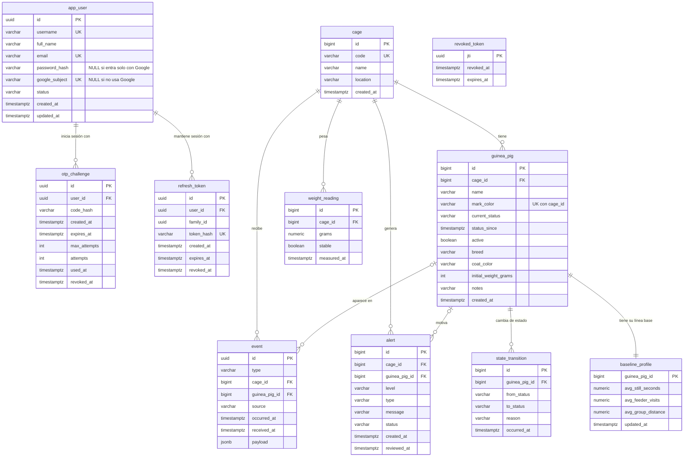

# cuy-monitor-db

Esquema de PostgreSQL del Monitor de Salud de Cuyes. Las migraciones **Flyway** son la única forma de crear o cambiar tablas; el backend (`cuy-monitor-backend`) no crea nada, solo valida.

## La base de datos en números

| | |
|---|---|
| **Tablas de negocio** | **11** |
| Tabla técnica de Flyway (`flyway_schema_history`) | 1 (12 tablas en total en PostgreSQL) |
| Relaciones (claves foráneas) | **10** |
| Migraciones | **8** (`V1` a `V8`) |
| Motor | PostgreSQL 18 (Amazon RDS en producción) |

Las 11 tablas se reparten en dos áreas: **usuarios y sesión** (4) y **jaula y salud** (7).

## Diagrama de relaciones



`revoked_token` no tiene relaciones a propósito: guarda el `jti` (y el id de sesión) de los JWT cerrados, que no pertenecen a una fila de otra tabla, y un job diario borra los vencidos. `refresh_token.family_id` agrupa los tokens de un mismo inicio de sesión (para revocarlos juntos si se reutiliza uno) y tampoco es una clave foránea.

## Las 11 tablas

### Usuarios y sesión

| Tabla | Migración | Para qué sirve |
|---|---|---|
| `app_user` | V2, V7 | Cuentas de quien mira el dashboard (un solo tipo de usuario). Entra con contraseña, con Google o ambas |
| `otp_challenge` | V2 | Códigos de un solo uso del inicio de sesión (guardados hasheados, con intentos y vencimiento) |
| `refresh_token` | V6 | Tokens de renovación de sesión (hasheados, con rotación y familias) |
| `revoked_token` | V5 | JWT cerrados antes de vencer (lista de revocación) |

### Jaula y salud

| Tabla | Migración | Para qué sirve |
|---|---|---|
| `cage` | V1, V3 | La jaula. Se identifica por un `code` (`cage-1`) que usan las cámaras y el dashboard |
| `guinea_pig` | V4, V8 | Cada cuy: nombre, color de marca (único por jaula), estado actual, y opcionalmente raza, color del pelaje, peso inicial y notas |
| `event` | V4 | Eventos que llegan de cámara, micrófono y báscula (`BEHAVIOR`, `AUDIO`, `WEIGHT`), con el JSON original en `payload` |
| `state_transition` | V4 | Historial de cambios de estado de cada cuy (`NORMAL`, `OBSERVED`, `ALERT`, `CRITICAL`) y su motivo |
| `alert` | V4 | Alertas abiertas o revisadas; pueden ser de un cuy o de toda la jaula (`guinea_pig_id` nulo) |
| `weight_reading` | V4 | Lecturas de la báscula de la jaula |
| `baseline_profile` | V4 | Línea base de comportamiento de cada cuy (quietud, visitas al comedero, distancia al grupo), 1 a 1 con `guinea_pig` |

## Relaciones (las 10 claves foráneas)

| Tabla origen | Columna | Apunta a | Restricción |
|---|---|---|---|
| `otp_challenge` | `user_id` | `app_user(id)` | `fk_otp_challenge_user` |
| `refresh_token` | `user_id` | `app_user(id)` | `fk_refresh_token_user` |
| `guinea_pig` | `cage_id` | `cage(id)` | `fk_guinea_pig_cage` |
| `event` | `cage_id` | `cage(id)` | `fk_event_cage` |
| `event` | `guinea_pig_id` | `guinea_pig(id)` | `fk_event_guinea_pig` (opcional) |
| `state_transition` | `guinea_pig_id` | `guinea_pig(id)` | `fk_state_transition_guinea_pig` |
| `alert` | `cage_id` | `cage(id)` | `fk_alert_cage` |
| `alert` | `guinea_pig_id` | `guinea_pig(id)` | `fk_alert_guinea_pig` (opcional) |
| `weight_reading` | `cage_id` | `cage(id)` | `fk_weight_reading_cage` |
| `baseline_profile` | `guinea_pig_id` | `guinea_pig(id)` | `fk_baseline_profile_guinea_pig` (es también su clave primaria) |

Restricciones de unicidad: `app_user` (`username`, `email`, `google_subject`), `cage.code`, `refresh_token.token_hash` y `guinea_pig (cage_id, mark_color)`, que impide dos cuyes con la misma marca en una jaula.

Los valores permitidos de cada enumeración (`HealthStatus`, `MarkColor`, raza, color del pelaje…) se validan con `CHECK`, no con tipos `ENUM`. Columnas, tipos y restricciones completas en [`docs/ARCHITECTURE.md`](docs/ARCHITECTURE.md).

## Migraciones

| Versión | Descripción |
|---|---|
| V1 | Esquema inicial (`cage`) |
| V2 | `app_user` y `otp_challenge` |
| V3 | Código de la jaula (`cage.code`) |
| V4 | Tablas de salud: `guinea_pig`, `event`, `state_transition`, `alert`, `weight_reading`, `baseline_profile` |
| V5 | `revoked_token` |
| V6 | `refresh_token` |
| V7 | Inicio de sesión con Google (`password_hash` opcional, `google_subject`) |
| V8 | Raza, color del pelaje, peso inicial y notas del cuy |

Además hay un seed solo para desarrollo (`seeds/dev/R__dev_seed.sql`), que nunca se aplica en producción.

## Estructura

| Ruta | Contenido |
|---|---|
| `migrations/` | Migraciones `V{n}__descripcion.sql` (se aplican en todos los entornos) |
| `seeds/dev/` | Datos de prueba, solo desarrollo |
| `scripts/` | Entrada de la imagen de migración |
| `docs/` | `PRD.md`, `ARCHITECTURE.md` (diccionario de datos) |

## Uso local

```bash
docker compose up -d                    # Postgres 18 + Flyway, aplica migrations/ y seeds/dev/
docker compose run --rm flyway info     # qué migraciones están aplicadas
docker compose run --rm flyway validate # verifica los checksums
docker compose down                     # los datos quedan en el volumen (down -v los borra)
```

Conexión local: `jdbc:postgresql://localhost:5432/cuymonitor`, usuario y contraseña `cuymonitor`.

## Reglas

- Nunca edites una migración que ya está en `main`; crea `V{n+1}`.
- Cada migración nueva actualiza el diccionario de datos en `docs/ARCHITECTURE.md` **y este README** (conteo de tablas, relaciones y diagrama).
- Commits en Conventional Commits; `main` solo por Pull Request.

Más detalle en `AGENTS.md`, `docs/PRD.md` y `docs/ARCHITECTURE.md`.
